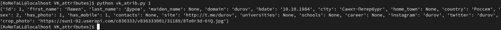

# VK_attributes
Программа которая получает информацию о пользователе в ВК

## Описание
Супер программа с супер функционалом.
Можно получить аттрибуты заданного пользователя.

Сначало установить зависимости.
Как-то так:
```pip3 install -r requirements.txt --user```

Потом можно запустить.
Как-то так:
```python vk_atrib.py 1```


Вот что получиться:
